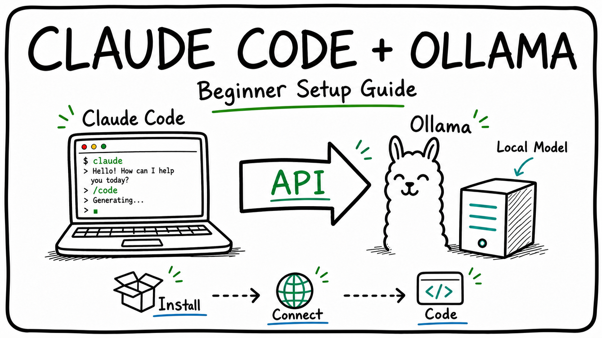

# Claude Code With Ollama: Beginner Step-by-Step Guide



This guide shows how to run Claude Code through Ollama so you can use local models from the Claude Code terminal tool.

Sources used:

- Official Ollama guide: [Claude Code - Ollama Docs](https://docs.ollama.com/integrations/claude-code)
- Official Ollama announcement: [Claude Code with Anthropic API compatibility](https://registry.ollama.ai/blog/claude)

## What You Are Setting Up

Normally, Claude Code talks to Anthropic's Claude API.

With Ollama, Claude Code can instead talk to Ollama's Anthropic-compatible API:

```text
Claude Code -> Ollama -> Local model
```

This means you can use models such as `qwen3.5`, `qwen3-coder`, or `gpt-oss:20b`, depending on what your computer can run.

## Step 1: Install Ollama

1. Go to the Ollama download page:

   <https://ollama.com/download>

2. Download Ollama for your operating system.

3. Install it like a normal app.

4. Open your terminal and check that Ollama works:

```bash
ollama --version
```

If you see a version number, Ollama is installed.

## Step 2: Install Claude Code

Install Claude Code using the command for your operating system.

### Windows PowerShell

```powershell
irm https://claude.ai/install.ps1 | iex
```

### macOS, Linux, or WSL

```bash
curl -fsSL https://claude.ai/install.sh | bash
```

After installation, check that Claude Code works:

```bash
claude --version
```

If you see a version number, Claude Code is installed.

## Step 3: Try the Easy Ollama Launcher

The simplest way is to let Ollama launch Claude Code for you:

```bash
ollama launch claude
```
### Run it fully Local

```bash
ollama launch claude --model gpt-oss:20b
```
> *Note: You need to have a porwerfull personal computer*


## Step 4: Choose a Model

Good beginner options:

| Model         | Notes                                           |
| ------------- | ----------------------------------------------- |
| `qwen3.5`     | Good general option if your computer can run it |
| `qwen3-coder` | Better for coding tasks                         |
| `gpt-oss:20b` | Recommended by Ollama for coding use cases      |

These models run locally on your computer.

## Step 5: Use Claude Code in a Project Folder

Open a terminal inside the folder of the project you want to work on.

Example:

```bash
cd path/to/your/project
ollama launch claude --model gpt-oss:20b
```

Then ask Claude Code something simple:

```text
Explain this project in simple terms.
```

Or:

```text
Find bugs in this codebase, but do not edit files yet.
```

## Simple Recommended Path

If you are a beginner, follow this order:

1. Install Ollama.
2. Install Claude Code.
3. Open your project folder in the terminal.
4. Run:

```bash
ollama launch claude
```

5. Choose a model.
6. Ask Claude Code to explain the project before asking it to edit anything.
