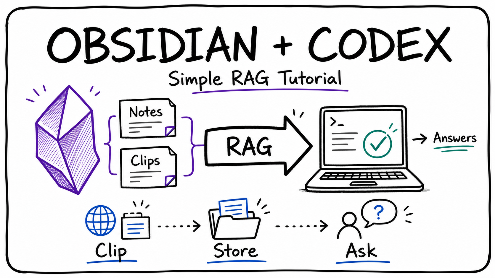

# Simple RAG With Codex and Obsidian



This guide shows a simple way to build a personal RAG-style workflow using Obsidian as your knowledge base and Codex as the assistant that reads and works with your notes.

RAG means Retrieval-Augmented Generation. In simple terms, you store useful information in files, then ask an AI assistant to answer questions using those files as context.

## What You Need

1. Obsidian installed
2. Obsidian Web Clipper installed in your browser
3. A Codex subscription, for example the ChatGPT Plus plan at about $20/month
4. A folder or Obsidian vault where your notes, PDFs, and clippings are stored

## Step 1: Download Obsidian

1. Go to the Obsidian website: https://obsidian.md
2. Download Obsidian for your operating system.
3. Install and open Obsidian.

## Step 2: Create an Obsidian Vault

1. Click **Create new vault**.
2. Give it a simple name, for example `Knowledge Base`.
3. Choose a folder location that is easy to find.
4. Click **Create**.

Your vault is just a normal folder containing Markdown files.

## Step 3: Add the Obsidian Web Clipper

1. Open your browser.
2. Search for **Obsidian Web Clipper**.
3. Install the official browser extension.
4. Connect the extension to your Obsidian vault.

Use the web clipper to save articles, documentation, tutorials, and references into your vault.

## Step 4: Organize Your Vault

Create a simple folder structure like this:

```text
Knowledge Base/
  Clippings/
  Notes/
  PDFs/
  Projects/
  index.md
```

Recommended usage:

- `Clippings/` for web pages saved with Obsidian Web Clipper
- `Notes/` for your own notes and summaries
- `PDFs/` for documents and references
- `Projects/` for project-specific research
- `index.md` as the main table of contents

## Step 5: Add Useful Content

Start adding content to your vault:

1. Clip useful web pages.
2. Save PDFs into the vault folder.
3. Write your own summaries in Markdown.
4. Create links between related notes using Obsidian links like `[[note name]]`.

Good RAG output depends on good source material. Keep notes clear, specific, and organized.

## Step 6: Open the Vault Folder in Codex

1. Open Codex.
2. Choose the Obsidian vault folder as the workspace.
3. Let Codex inspect the Markdown files and folders.

Now Codex can use the vault files as local context.

## Step 7: Ask Codex Questions About Your Notes

Example prompts:

```text
Read my Obsidian vault and summarize the main ideas in the Clippings folder.
```

```text
Using only the notes in this vault, explain the topic in simple terms.
```

```text
Find all notes related to RAG and create a study guide.
```

```text
Create an index.md file that links the most important notes by topic.
```

```text
Compare the PDFs and notes in this vault and list repeated ideas.
```

## Step 8: Create Better Notes for Better Retrieval

For each important topic, create a short summary note:

```markdown
# Topic Name

## Summary

Short explanation of the topic.

## Key Points

- Point 1
- Point 2
- Point 3

## Sources

- [[clipped article name]]
- [[related PDF]]
```

This makes it easier for Codex to find and use the right information.

## Step 9: Use Codex to Improve the Vault

Ask Codex to help maintain the knowledge base:

```text
Find duplicate notes and suggest which ones can be merged.
```

```text
Create tags for these notes based on their topics.
```

```text
Make a beginner-friendly summary for every note in the Clippings folder.
```

```text
Create a glossary from all Markdown files in this vault.
```

## Step 10: Simple RAG Workflow

Use this repeatable workflow:

1. Save useful information into Obsidian.
2. Organize it into folders and linked notes.
3. Open the vault in Codex.
4. Ask Codex questions using the vault as context.
5. Ask Codex to create summaries, indexes, glossaries, and study guides.
6. Keep improving the notes over time.

## Example End-to-End Prompt

```text
I have notes, links, articles, and PDF files in my obsidian vault.

Let's create a wiki on the main topic and make it simple and easy to read. Also summarize the broad concepts and add helpful diagrams if possible.
Lastly add an index.md file for the entry point of this wiki; it should categorize all the information by the concepts and link each related topic.
```

## Tips

- Keep one idea per note when possible.
- Use clear file names.
- Add summaries to long clipped articles.
- Link related notes together.
- Put source links inside notes.
- Ask Codex to cite the file names it used.
- Keep PDFs and Markdown files in the same vault folder.

## Simple Setup Checklist

- [ ] Download Obsidian
- [ ] Create an Obsidian vault
- [ ] Install Obsidian Web Clipper
- [ ] Save useful web pages and PDFs
- [ ] Add summaries and links
- [ ] Open the vault folder in Codex
- [ ] Ask Codex questions using the vault files
- [ ] Use Codex to create indexes, summaries, and study guides
