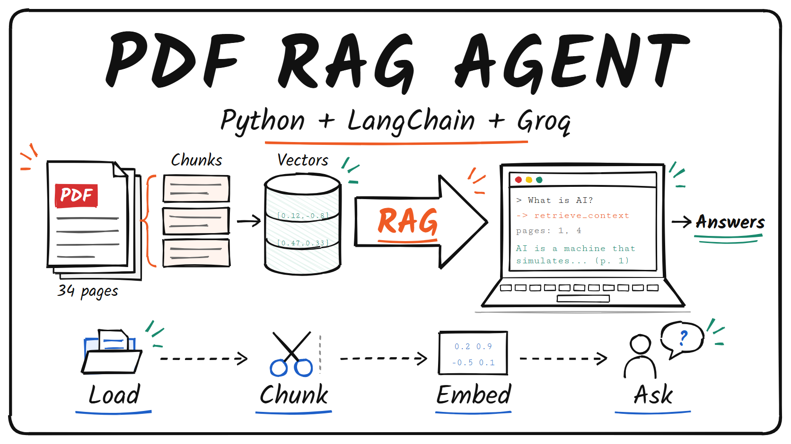

# PDF RAG Agent: Beginner Step-by-Step Guide



This guide shows how to build a small AI agent that answers questions about your own PDF. It uses Python, LangChain, a free Groq API key, and a free embedding model that runs on your computer.

Sources used:

- Video tutorial: [StatLearn Tech — Complete RAG Pipeline Tutorial: Build a PDF Agent with Python, LangChain, & Groq](https://www.youtube.com/watch?v=g8FIfgKYtyI)
- Groq API keys: [console.groq.com/keys](https://console.groq.com/keys)
- Groq models list: [console.groq.com/docs/models](https://console.groq.com/docs/models)

## What You Are Setting Up

RAG means **Retrieval-Augmented Generation**:

- **Retrieval** — find the parts of your PDF that match the question.
- **Augmented** — add those parts to the prompt.
- **Generation** — the AI writes the answer from those parts.

```text
Your question -> Agent -> searches the PDF -> top 3 matching chunks -> Groq LLM -> answer with page numbers
```

Behind the scenes, the PDF is prepared once when the script starts:

```text
PDF -> split into small chunks -> turned into vectors (embeddings) -> stored in memory
```

## What You Need

| Thing           | Why                                         |
| --------------- | ------------------------------------------- |
| Python 3.10+    | Runs the script                             |
| A Groq API key  | Free. Gives access to the AI model          |
| A PDF           | The document you want to ask questions about |
| About 1 GB disk | For Python packages and the embedding model |

Project files:

| File               | Purpose                                         |
| ------------------ | ----------------------------------------------- |
| `rag_1.py`         | The RAG agent script                            |
| `requirements.txt` | List of Python packages to install              |
| `.env.example`     | Template for your settings                      |
| `.env`             | **You create this.** Holds your secret Groq key |
| `.gitignore`       | Keeps `.env` and `.venv/` out of git            |
| `pdf-sample.pdf`   | Sample PDF to ask questions about               |

## Step 1: Install Python

1. Go to the Python download page:

   <https://www.python.org/downloads/>

2. Download and install it.

   > *Windows: tick **"Add python.exe to PATH"** on the first installer screen.*

3. Open a terminal and check that Python works:

```bash
python --version
```

If you see a version number like `Python 3.12.x`, Python is installed.

> *macOS / Linux: use `python3` instead of `python` if `python` is not found.*

## Step 2: Get a Free Groq API Key

Groq is not an AI model itself. It is a provider that hosts open-source models, and its API key is free.

1. Open <https://console.groq.com/keys>
2. Sign in (Google / Gmail login works).
3. Click **Create API Key**, give it a name (for example `pdf-rag`), and click **Submit**.
4. Copy the key right away. It starts with `gsk_`.

> *Groq only shows the key once. If you lose it, delete it and create a new one.*

## Step 3: Open the Project Folder

Open a terminal inside the `rag` folder:

```bash
cd path/to/AI-tuts/rag
```

## Step 4: Create a Virtual Environment

A virtual environment keeps this project's packages separate from the rest of your computer.

### Windows PowerShell

```powershell
python -m venv .venv
.venv\Scripts\Activate.ps1
```

If PowerShell says running scripts is disabled, run this once, then try again:

```powershell
Set-ExecutionPolicy -Scope CurrentUser RemoteSigned
```

### macOS, Linux, or WSL

```bash
python3 -m venv .venv
source .venv/bin/activate
```

When it works, your terminal line starts with `(.venv)`.

## Step 5: Install the Packages

```bash
pip install -r requirements.txt
```

What each package does:

| Package                    | Job                                        |
| -------------------------- | ------------------------------------------ |
| `langchain`                | Builds the agent                           |
| `langchain-text-splitters` | Cuts the PDF into small chunks             |
| `langchain-groq`           | Connects to Groq's AI models               |
| `langchain-huggingface`    | Connects to the embedding model            |
| `sentence-transformers`    | Runs the embedding model on your computer  |
| `pypdf`                    | Reads text from the PDF                    |
| `python-dotenv`            | Loads your key from the `.env` file        |

This can take a few minutes the first time.

## Step 6: Add Your Groq Key

Copy the example settings file to `.env`.

### Windows PowerShell

```powershell
Copy-Item .env.example .env
```

### macOS, Linux, or WSL

```bash
cp .env.example .env
```

Open `.env` in any text editor and replace the placeholder with your real key:

```text
GROQ_API_KEY=gsk_your_real_key
```

Rules:

- No quotes.
- No spaces around `=`.
- The name must be exactly `GROQ_API_KEY`.

> *Never share or commit your `.env` file. It is already listed in `.gitignore`.*

Optional settings in the same file:

```text
# Use a different Groq model (see console.groq.com/docs/models)
GROQ_MODEL=openai/gpt-oss-20b

# Use your own PDF instead of the sample
PDF_PATH=my-document.pdf
```

## Step 7: Run the Agent

Ask one question:

```bash
python rag_1.py "What is AI according to the document?"
```

Or start interactive mode and keep asking questions (press Enter on a blank line to quit):

```bash
python rag_1.py
```

The first run downloads the embedding model (about 90 MB). Later runs are faster.

Expected output looks like this:

```text
Loading PDF document...
Loaded 34 pages -> 79 chunks
Building embeddings...
  -> retrieve_context "definition of artificial intelligence"
     pages: 3, 4, 11

Artificial intelligence is ... (p. 3)
```

Want to see every step in full (tool calls and the exact chunks found)? Add `-v`:

```bash
python rag_1.py -v "What is AI according to the document?"
```

## Step 8: Try Good Beginner Questions

Whole-document questions:

```text
What is this document about?
```

Specific questions:

```text
What are the types of AI?
```

```text
How is AI used in healthcare?
```

A question the PDF does not cover (the agent should say it can't find it):

```text
Who won the 2022 World Cup?
```

## How the Code Works (Simple Version)

1. **Load the key** — reads `GROQ_API_KEY` from `.env`.
2. **Create the AI model** — `ChatGroq` connects to a model hosted on Groq.
3. **Read the PDF** — one piece of text per page. Repeated page headers and page numbers are removed.
4. **Split into chunks** — pieces of up to 1000 characters, with 200 characters of overlap so a sentence cut in half still makes sense in one of the chunks.
5. **Embed the chunks** — each chunk becomes a list of numbers (a vector). Similar meaning = similar numbers, so searching is fast.
6. **Give the agent tools**:
   - `retrieve_context` — finds the 3 most relevant chunks for a question.
   - `document_overview` — gives the title and the start of every page, for "what is this PDF about?" questions.
7. **Build the agent** — model + tools + instructions ("answer only from the PDF and cite page numbers").
8. **Stream the answer** — prints each step: tool call, pages found, final answer.

## Troubleshooting

| Problem                                        | Fix                                                                  |
| ---------------------------------------------- | -------------------------------------------------------------------- |
| `GROQ_API_KEY missing`                         | `.env` not created, or the variable name is wrong                    |
| `401 Invalid API Key`                          | Key has a typo or was deleted. Create a new one                      |
| `PDF not found`                                | Put the PDF in the `rag` folder, or set `PDF_PATH` in `.env`         |
| `model_decommissioned` / `model_not_found`     | Set `GROQ_MODEL` to a current model from the Groq models page        |
| `tool_use_failed`                              | That model can't use tools well. Switch back to `openai/gpt-oss-20b` |
| `429 rate limit`                               | Free tier limit reached. Wait a minute and try again                 |
| `ModuleNotFoundError`                          | Virtual environment not active. Activate it (Step 4) and reinstall   |
| PowerShell blocks `Activate.ps1`               | Run `Set-ExecutionPolicy -Scope CurrentUser RemoteSigned` once       |
| Hugging Face symlink or tokenizer warnings     | Harmless. Ignore them                                                |

## Simple Recommended Path

If you are a beginner, follow this order:

1. Install Python.
2. Get a free Groq API key.
3. Open the `rag` folder in the terminal.
4. Create and activate the virtual environment.
5. Run:

```bash
pip install -r requirements.txt
```

6. Copy `.env.example` to `.env` and paste your key.
7. Run:

```bash
python rag_1.py "What is this document about?"
```

8. Try your own PDF by setting `PDF_PATH` in `.env`.
