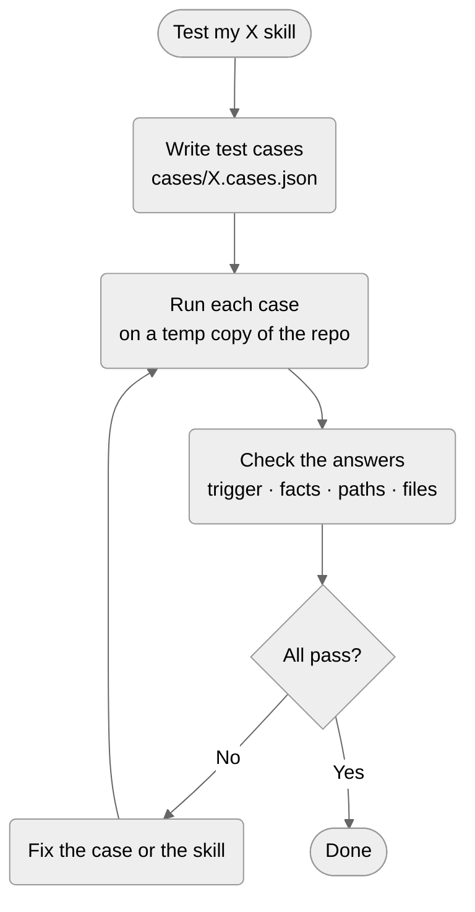

# skill-eval

Test whether another skill gives **correct** answers, not just good-sounding ones.

It runs your skill on a few test prompts, then checks the answers against your real code or docs.

## How it works



## What it checks

- **Did the skill trigger?** Runs when it should, stays quiet when it shouldn't.
- **Are the facts right?** Required words/values appear; known-wrong ones don't.
- **Are file paths real?** Catches the skill inventing files that don't exist.
- **Were files created?** For skills that generate files.
- **Rubric (optional):** An AI grader checks trickier things against reference files.

## Quick start

**1. You need:** Python 3.9+ and the `claude` CLI (logged in). Or `copilot` CLI.

**2. Write a test file** in a `cases/` folder, e.g. `cases/my-skill.cases.json`:

```json
{
  "skill": "my-skill",
  "repo": ".",
  "cases": [
    {
      "id": "basic",
      "prompt": "Use my-skill to explain the login endpoint.",
      "should_trigger": true,
      "must_include": ["POST /api/login"]
    },
    {
      "id": "should-not-run",
      "prompt": "Fix the typo in README.md",
      "should_trigger": false
    }
  ]
}
```

Tip: only add facts to `must_include` that you've confirmed are in your code.

**3. Run it:**

```bash
python .claude/skills/skill-eval/scripts/run_skill_eval.py --cases cases/my-skill.cases.json
```

Results land next to `cases/`:

```
cases/
  my-skill.cases.json
runs/
  my-skill/
    20261002-011153-claude/
      basic.jsonl
      should-not-run.jsonl
      report.html      <- open this
      summary.json
```

The folder can be anywhere. `cases/` and `runs/` always sit side by side in the **eval dir**:

```bash
# cases file inside a cases/ folder -> runs/ goes next to it
python .../run_skill_eval.py --cases tests/skills/cases/my-skill.cases.json

# or name the eval dir and pass just the skill name
python .../run_skill_eval.py --cases my-skill --eval-dir tests/skills
export SKILL_EVAL_DIR=~/skill-evals   # same, set once
```

`"repo"` in the cases file is relative to the eval dir.

Or just ask Claude: *"test my my-skill skill"*.

## Reading the results

You get a table of PASS / FAIL per check plus two scores:

- **trigger/process:** did the skill run at the right times?
- **accuracy:** were the answers correct?

Open `report.html` in the run folder for the full picture: scores, a pass/fail grid, and each case's prompt, answer and failure notes. Raw logs (`.jsonl`) and `summary.json` sit next to it. Rebuild a report with `--report runs/<skill>/<run>`.

## Good to know

- Tests run on a **temporary copy** of your repo. Your files are safe.
- Add `--isolated` (Claude only) so your own plugins, hooks and MCP servers don't change the results.
- Each test case costs roughly $0.10–0.50 on Claude.
- Start with 4–6 cases. Add a new case whenever you find a real bug.
- Every case fails with an empty answer? The CLI isn't installed or logged in.

## Files

| File | What it does |
|---|---|
| `SKILL.md` | Instructions Claude follows when you ask it to test a skill |
| `scripts/run_skill_eval.py` | The script that runs the tests and scores them |
